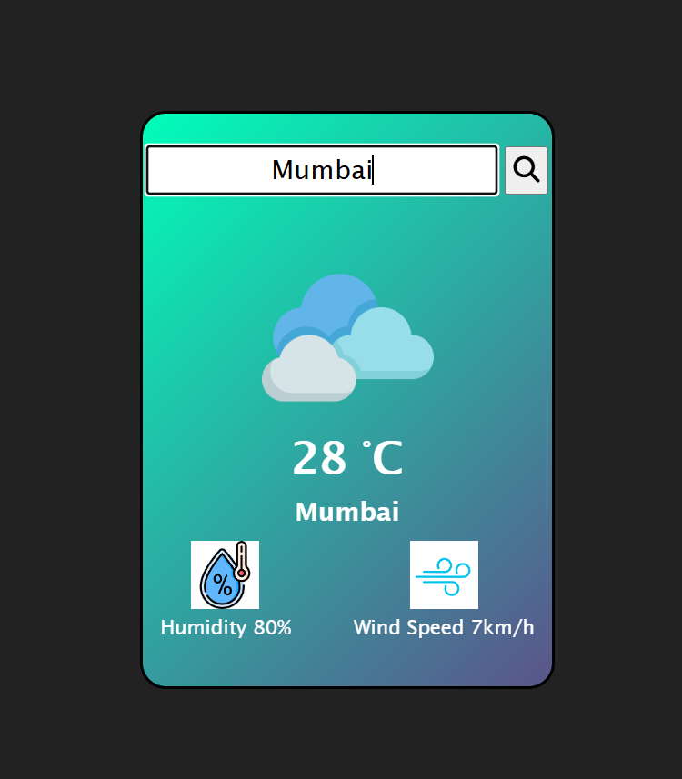

# 🌤️ Weather App

A simple and responsive weather application that allows users to search for real-time weather information by city. Built using HTML, CSS, and JavaScript, and powered by the OpenWeatherMap API.

---

## 📸 Screenshots

 

---

## 🔧 Features

- 🔍 Search weather by city name
- 🌡️ Displays temperature, humidity, wind speed
- 🌤️ Dynamic weather icons based on current weather
- 📱 Fully responsive UI

---

## 🛠️ Technologies Used

- HTML5
- CSS3
- JavaScript (ES6)
- [OpenWeatherMap API](https://openweathermap.org/api)

---

## 🔐 API Key Setup

This app uses the [OpenWeatherMap API](https://openweathermap.org/api), which requires an API key.

### 👉 Steps to run the project locally:

1. Go to [https://openweathermap.org/api](https://openweathermap.org/api) and sign up to get your **free API key**.
2. In the `app.js` file, locate the line:
   ```javascript
   const API_KEY = "your_api_key_here";
